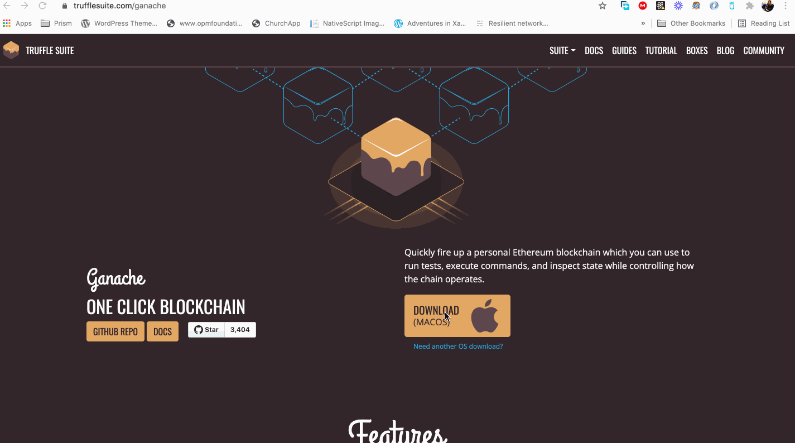

# BlockChain Smart Contract

   

    

    September 30th, 2021 - This project was done as a result of my learnings from <a href='https://emurgo.io/education'>EMURGO</a>, this is a project prototype of Emurgo Smart Contract Certificate  
    by <a href='https://github.com/kendevops'>Kenneth Aladi</a>.

## What?

**This is a simple Decentralized Application (Dapp) which can be used to register certificate on the blockchain:**

    

## How?

There are a few languages such as Solidity and Vyper can be used to write smart contract. This was built using solidity to create our smart contracts. The syntax of solidity is very similar to that of JavaScript and this is used for Ethereum virtual machine. Solidty is an object oriented, high level language for implementing smart contracts as it's statically typed, it supports inheritance, and complexed user-defined types among other features.

This was done using HTML, Bootstrap, Javascript and i used the <a href='https://remix.ethereum.org/#optimize=false&runs=200&evmVersion=null&version=soljson-v0.8.7+commit.e28d00a7.js'>Remix</a> (which is a browser-based compiler and IDE for developers to build Ethereum contracts with solidity language and to debug transactions) for the compilation. 

    

## WEB3 Tech!

I used Web3.js to communicate between the website and smart contract. For this i used a simple handy tool to simulate a blockchain in my local computer. I made use of <a href='https://www.trufflesuite.com/ganache'>Ganache</a>, which quickly fires up personal view from blockchain which can be used to execute commands and inspect state while controlling how the chain operates.

    

